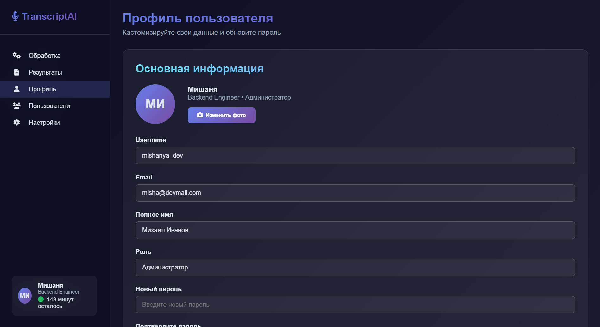

# 🎧 TranscriptAI — Веб-приложение для транскрибации и анализа аудио

Этот проект представляет собой одностраничное приложение (SPA) на **React + Vite**.  
Приложение включает в себя авторизацию (Login / Register), загрузку файлов, транскрибацию аудио и работу с журналом активности.  
Основной упор сделан на простую навигацию, переиспользуемые компоненты и современный интерфейс.

---

## Технологии

- **React** — для построения интерфейса  
- **Vite** — для быстрого сборщика и разработки  
- **CSS Modules** — для изолированных стилей  

---

## Функциональность

- Авторизация и регистрация пользователей
- Загрузка аудиофайлов для транскрибации
- Drag & Drop файлов
- Журнал активности (лог действий)
- Настройки приложения
- Статистика и управление файлами

---

## Скриншот

